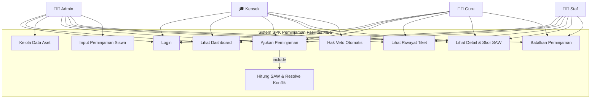
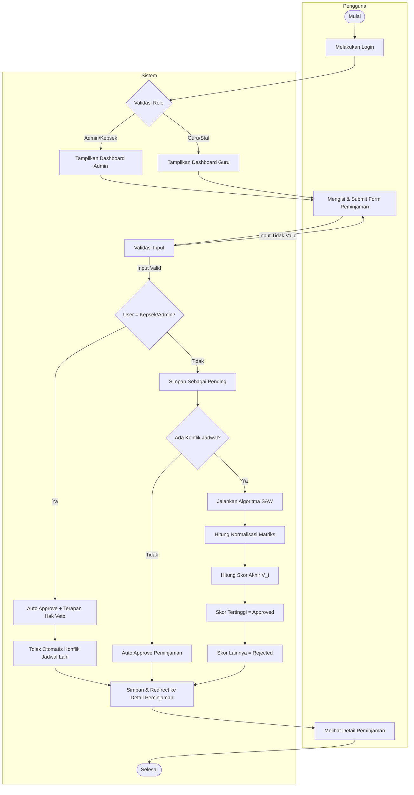
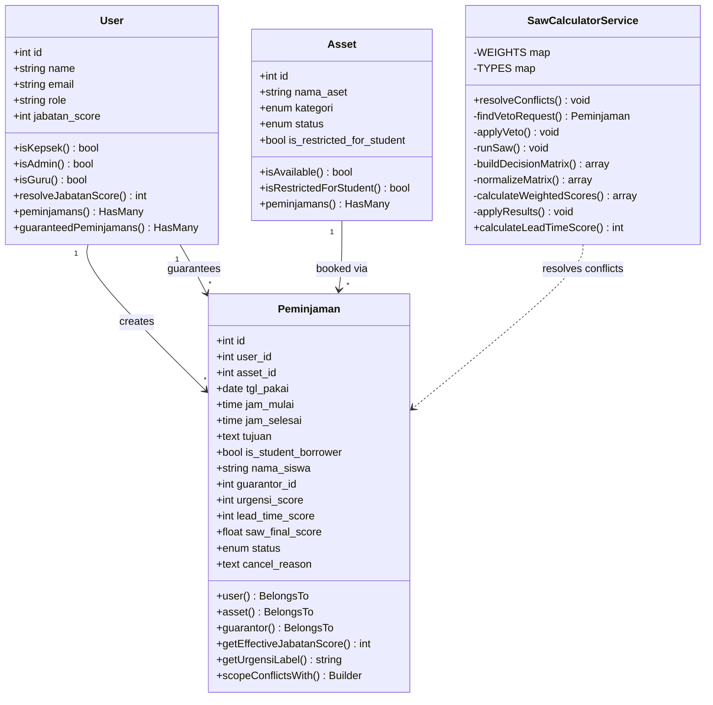
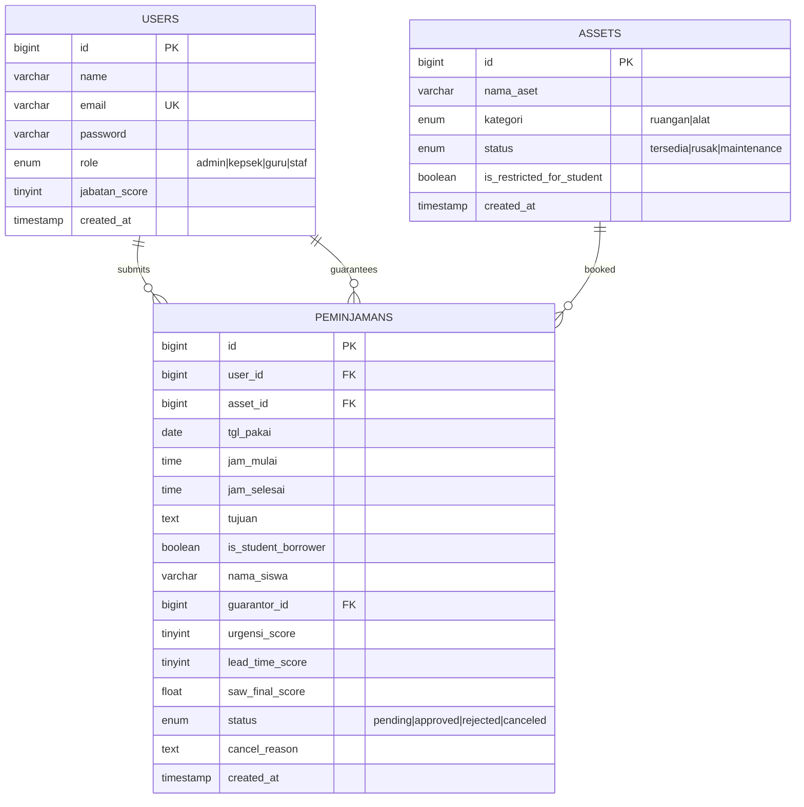

<p align="center">
  
</p>

<h1 align="center">MBS Booking — Sistem Pendukung Keputusan Peminjaman Fasilitas</h1>

<p align="center">
  <strong>MBS A.R. Fachruddin</strong> · Laravel 12 · SAW Algorithm · Tailwind CSS v4
</p>

<p align="center">
  
  
  
  
  
</p>

---

## 📋 Deskripsi Proyek

**MBS Booking** adalah Sistem Pendukung Keputusan (SPK) untuk peminjaman fasilitas sekolah MBS A.R. Fachruddin. Sistem ini menggunakan algoritma **Simple Additive Weighting (SAW)** untuk menyelesaikan konflik jadwal secara otomatis, objektif, dan transparan.

Ketika dua atau lebih pengguna meminjam fasilitas yang sama pada waktu yang bertumpuk, sistem akan mengevaluasi setiap permintaan berdasarkan tiga kriteria (Jabatan, Urgensi, Lead Time), melakukan normalisasi, lalu menentukan pemenang berdasarkan skor tertinggi.

---

## 🏗️ Arsitektur Sistem

```
┌─────────────────────────────────────────────────────────┐
│                      BROWSER                            │
│   Login ─→ Dashboard ─→ Form Peminjaman ─→ Detail Tiket │
└──────────────────────┬──────────────────────────────────┘
                       │ HTTP Request
┌──────────────────────▼──────────────────────────────────┐
│                   LARAVEL 12                            │
│  ┌──────────┐  ┌────────────┐  ┌─────────────────────┐ │
│  │  Routes  │→ │ Middleware │→ │    Controllers       │ │
│  │ web.php  │  │   Role     │  │ Admin / Guru         │ │
│  └──────────┘  └────────────┘  └──────────┬──────────┘ │
│                                           │             │
│  ┌────────────────────┐  ┌────────────────▼──────────┐ │
│  │  Form Requests     │  │  SawCalculatorService     │ │
│  │  (Validation)      │  │  (Conflict Resolution)    │ │
│  └────────────────────┘  └────────────────┬──────────┘ │
│                                           │             │
│  ┌────────────────────────────────────────▼──────────┐ │
│  │              Eloquent Models                      │ │
│  │         User ─ Asset ─ Peminjaman                 │ │
│  └────────────────────────────────────────┬──────────┘ │
└───────────────────────────────────────────┼─────────────┘
                                            │ SQL
┌───────────────────────────────────────────▼─────────────┐
│                    MySQL / MariaDB                      │
│            users · assets · peminjamans                 │
└─────────────────────────────────────────────────────────┘
```

---

## 🔑 Fitur Utama

| Fitur | Deskripsi |
|-------|-----------|
| **Algoritma SAW** | Menentukan prioritas peminjaman secara objektif menggunakan 3 kriteria terbobot |
| **Hak Veto Kepsek & Admin** | Kepsek/Admin otomatis disetujui & membatalkan konflik yang ada |
| **Peminjaman Siswa** | Admin dapat mengajukan atas nama siswa dengan Guru Penanggung Jawab |
| **Multi-Role** | 4 role: Admin, Kepsek, Guru, Staf — masing-masing dengan dashboard terpisah |
| **Deteksi Konflik** | Otomatis mendeteksi jadwal bertumpuk dan menjalankan SAW |
| **Ticket System** | Setiap peminjaman diberi ID tiket (#TKT-0001) untuk tracking mudah |
| **Pembatalan Tiket** | Admin dapat membatalkan peminjaman (Force Cancel), Guru/Staf dapat membatalkan peminjamannya sendiri |

---

## 👥 Manajemen Role & Hak Akses

| Role | Dashboard | Akses | Jabatan Score (C1) |
|------|-----------|-------|--------------------|
| **Admin** | `/admin/dashboard` | Full CRUD aset + semua peminjaman + input siswa + **Hak Veto** | 0 (tidak ikut SAW) |
| **Kepsek** | `/admin/dashboard` | Sama seperti admin + **Hak Veto** otomatis | 4 |
| **Guru** | `/dashboard` | Ajukan peminjaman + lihat riwayat sendiri | 3 |
| **Staf** | `/dashboard` | Ajukan peminjaman + lihat riwayat sendiri | 2 |

---

## ⚖️ Algoritma SAW — Simple Additive Weighting

### Definisi Kriteria

| Kode | Kriteria | Tipe | Bobot | Nilai |
|------|----------|------|-------|-------|
| **C1** | Jabatan / Role | Benefit | 0.40 | Kepsek=4, Guru=3, Staf=2 |
| **C2** | Urgensi Kegiatan | Benefit | 0.35 | Ujian=4, KBM=3, Rapat=2, Ekskul=1 |
| **C3** | Lead Time (Waktu Pengajuan) | Cost | 0.25 | H-7+=3, H-3~H-6=2, <H-3=1 |

### Langkah Perhitungan

```
1. Bangun Matriks Keputusan
   X = | C1  C2  C3 |
       | x11 x12 x13|  ← Alternatif 1
       | x21 x22 x23|  ← Alternatif 2

2. Normalisasi
   Benefit: r_ij = x_ij / max(x_j)
   Cost:    r_ij = min(x_j) / x_ij

3. Hitung Skor Akhir
   V_i = Σ (w_j × r_ij)
   V_i = (0.40 × r_C1) + (0.35 × r_C2) + (0.25 × r_C3)

4. Ranking: Skor tertinggi = APPROVED, sisanya = REJECTED
```

### Contoh Perhitungan

| Peminjam | C1 (Jabatan) | C2 (Urgensi) | C3 (Lead Time) |
|----------|:---:|:---:|:---:|
| Guru Budi | 3 | 4 (Ujian) | 3 (H-7) |
| Staf Dewi | 2 | 2 (Rapat) | 1 (Hari H) |

**Normalisasi:**

| Peminjam | r_C1 | r_C2 | r_C3 |
|----------|:---:|:---:|:---:|
| Guru Budi | 3/3 = 1.00 | 4/4 = 1.00 | 1/3 = 0.33 |
| Staf Dewi | 2/3 = 0.67 | 2/4 = 0.50 | 1/1 = 1.00 |

**Skor Akhir:**
- V(Budi) = (0.40×1.00) + (0.35×1.00) + (0.25×0.33) = **0.8325** ✅ Winner
- V(Dewi) = (0.40×0.67) + (0.35×0.50) + (0.25×1.00) = **0.6930** ❌ Rejected

---

## 📐 UML Diagrams

### Use Case Diagram



### Activity Diagram — Alur Peminjaman



### Class Diagram



### Entity Relationship Diagram (ERD)



---

## 📁 Struktur Proyek

```
mbs-booking/
├── app/
│   ├── Http/
│   │   ├── Controllers/
│   │   │   ├── AuthController.php            # Login / Logout
│   │   │   ├── Admin/
│   │   │   │   ├── DashboardController.php   # Dashboard admin + statistik
│   │   │   │   ├── AssetController.php       # CRUD aset/fasilitas
│   │   │   │   └── PeminjamanController.php  # Kelola semua peminjaman + SAW
│   │   │   └── Guru/
│   │   │       ├── DashboardController.php   # Dashboard guru/staf
│   │   │       └── PeminjamanController.php  # Ajukan & lihat peminjaman sendiri
│   │   ├── Middleware/
│   │   │   └── RoleMiddleware.php            # Otorisasi berdasarkan role
│   │   └── Requests/
│   │       ├── Auth/LoginRequest.php         # Validasi login
│   │       ├── StoreAssetRequest.php         # Validasi create aset
│   │       ├── UpdateAssetRequest.php        # Validasi update aset
│   │       └── StorePeminjamanRequest.php    # Validasi peminjaman + cek restricted
│   ├── Models/
│   │   ├── User.php                          # Model user + role constants + SAW helper
│   │   ├── Asset.php                         # Model aset + status helper
│   │   └── Peminjaman.php                    # Model peminjaman + conflict scope + SAW helper
│   └── Services/
│       └── SawCalculatorService.php          # Mesin SAW (inti algoritma)
├── database/
│   ├── migrations/                           # 5 migration files
│   └── seeders/
│       ├── UserSeeder.php                    # 7 akun demo (admin, kepsek, 3 guru, 2 staf)
│       └── AssetSeeder.php                   # 8 aset demo (5 ruangan, 3 alat)
├── resources/
│   ├── css/app.css                           # Design system (ticket cards, SAW meters, animations)
│   └── views/
│       ├── layouts/
│       │   ├── guest.blade.php               # Layout login
│       │   ├── admin.blade.php               # Sidebar indigo (admin/kepsek)
│       │   └── guru.blade.php                # Sidebar emerald (guru/staf)
│       ├── auth/login.blade.php              # Halaman login (glassmorphism)
│       ├── admin/
│       │   ├── dashboard.blade.php           # Dashboard admin (bento grid)
│       │   ├── assets/                       # index, create, edit
│       │   └── peminjamans/                  # index, create, show
│       └── guru/
│           ├── dashboard.blade.php           # Dashboard guru (CTA banner)
│           └── peminjamans/                  # index, create, show
└── routes/web.php                            # 24 routes (guest, admin, guru)
```

---

## 🗺️ Route Map

| Method | URI | Controller | Middleware |
|--------|-----|------------|-----------|
| GET | `/login` | AuthController@showLogin | guest |
| POST | `/login` | AuthController@login | guest |
| POST | `/logout` | AuthController@logout | auth |
| GET | `/admin/dashboard` | Admin\DashboardController@index | auth, role:admin,kepsek |
| GET | `/admin/assets` | Admin\AssetController@index | auth, role:admin,kepsek |
| GET | `/admin/assets/create` | Admin\AssetController@create | auth, role:admin,kepsek |
| POST | `/admin/assets` | Admin\AssetController@store | auth, role:admin,kepsek |
| GET | `/admin/assets/{id}/edit` | Admin\AssetController@edit | auth, role:admin,kepsek |
| PUT | `/admin/assets/{id}` | Admin\AssetController@update | auth, role:admin,kepsek |
| DELETE | `/admin/assets/{id}` | Admin\AssetController@destroy | auth, role:admin,kepsek |
| GET | `/admin/peminjamans` | Admin\PeminjamanController@index | auth, role:admin,kepsek |
| GET | `/admin/peminjamans/create` | Admin\PeminjamanController@create | auth, role:admin,kepsek |
| POST | `/admin/peminjamans` | Admin\PeminjamanController@store | auth, role:admin,kepsek |
| GET | `/admin/peminjamans/{id}` | Admin\PeminjamanController@show | auth, role:admin,kepsek |
| PUT | `/admin/peminjamans/{id}/cancel` | Admin\PeminjamanController@cancel | auth, role:admin,kepsek |
| GET | `/dashboard` | Guru\DashboardController@index | auth, role:guru,staf |
| GET | `/peminjamans` | Guru\PeminjamanController@index | auth, role:guru,staf |
| GET | `/peminjamans/create` | Guru\PeminjamanController@create | auth, role:guru,staf |
| POST | `/peminjamans` | Guru\PeminjamanController@store | auth, role:guru,staf |
| GET | `/peminjamans/{id}` | Guru\PeminjamanController@show | auth, role:guru,staf |
| PUT | `/peminjamans/{id}/cancel` | Guru\PeminjamanController@cancel | auth, role:guru,staf |

---

## 💡 Instalasi & Konfigurasi

### Prasyarat
- PHP ≥ 8.2
- Composer
- Node.js ≥ 18
- MySQL / MariaDB (XAMPP)

### Langkah Instalasi

```bash
# 1. Clone repository
git clone https://github.com/Rizalibrah08/booking-sistem.git
cd booking-sistem

# 2. Install dependencies
composer install
npm install

# 3. Konfigurasi environment
cp .env.example .env
php artisan key:generate

# 4. Buat database di phpMyAdmin, lalu edit .env:
#    DB_DATABASE=booking_db
#    DB_USERNAME=root
#    DB_PASSWORD=

# 5. Jalankan migrasi & seeder
php artisan migrate --seed

# 6. Build assets
npm run build

# 7. Jalankan server
php artisan serve
```

### Akun Demo

| Role | Email | Password |
|------|-------|----------|
| Admin | `admin@mbs.sch.id` | password |
| Kepsek | `kepsek@mbs.sch.id` | password |
| Guru | `rizal@mbs.sch.id` | password |
| Guru | `siti@mbs.sch.id` | password |
| Guru | `arief@mbs.sch.id` | password |
| Staf | `dewi@mbs.sch.id` | password |
| Staf | `rian@mbs.sch.id` | password |

---

## 📸 Screenshot Aplikasi

### Login Page
> Glassmorphism design dengan gradient dark background dan branding MBS.

### Admin Dashboard
> Bento grid layout menampilkan statistik (Total Aset, Peminjaman Hari Ini, Pending, Approved) dengan sidebar indigo.

### Detail Tiket & Skor SAW
> Ticket-style card dengan breakdown visual skor SAW per kriteria (C1, C2, C3) menggunakan progress bar.

### Guru Dashboard
> Emerald theme dengan CTA banner, jadwal mendatang, dan riwayat peminjaman terbaru.

---

## ❓ FAQ

> **Q: Bagaimana algoritma SAW menentukan prioritas?**
>
> **A:** Setiap permintaan dinilai berdasarkan 3 kriteria (Jabatan w=0.40, Urgensi w=0.35, Lead Time w=0.25). Nilai dinormalisasi, dikalikan bobot, lalu dijumlahkan. Skor tertinggi disetujui, sisanya ditolak.

> **Q: Apa itu Hak Veto?**
>
> **A:** Jika Kepala Sekolah atau Admin mengajukan peminjaman (bukan atas nama siswa), permintaan langsung disetujui dan semua jadwal yang bertumpuk otomatis ditolak (rejected) tanpa melalui SAW.

> **Q: Bagaimana peminjaman untuk siswa?**
>
> **A:** Siswa tidak memiliki akun. Admin menginput peminjaman atas nama siswa dan wajib memilih Guru Penanggung Jawab. Skor jabatan yang digunakan dalam SAW adalah skor guru tersebut.

> **Q: Apa yang terjadi jika tidak ada konflik?**
>
> **A:** Peminjaman langsung disetujui (auto-approve) tanpa menjalankan SAW.

---

## 🛠️ Tech Stack

| Komponen | Teknologi |
|----------|-----------|
| Backend | Laravel 12.x (PHP 8.2) |
| Database | MySQL 8.0 / MariaDB |
| Frontend | Blade Templates + Tailwind CSS v4 |
| Build Tool | Vite 7 |
| Font | Inter (Google Fonts) |
| Auth | Laravel Built-in Authentication |

---

## 📝 Lisensi

Proyek ini dibuat untuk keperluan Kerja Praktik (KP) di **MBS A.R. Fachruddin**.
Framework Laravel dilisensikan di bawah [MIT License](https://opensource.org/licenses/MIT).
